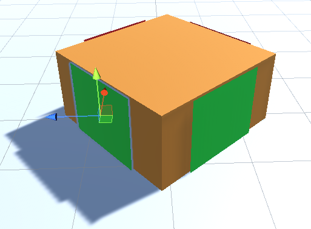

# Cover system in Unity

This prefab and scripts allow the level designer to pick locations in the environment where AI players can find cover against enemy fire.

The locations are marked by a two-sided quad with a green and a red side. The red side is placed against an object. The green side is where the AI player can hide.

